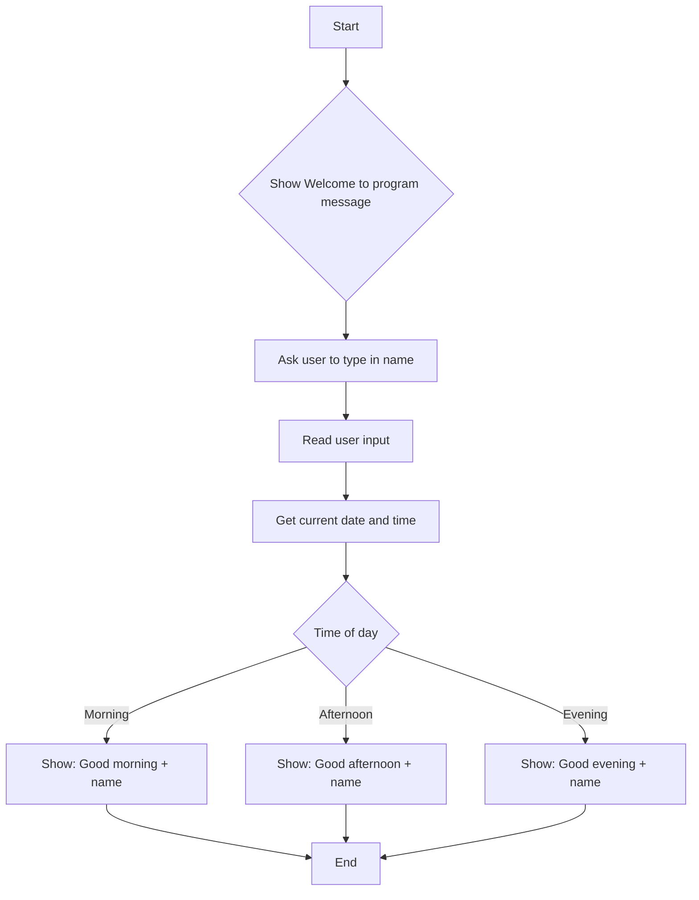

# Custom welcome message

## Description

Creating a customized welcome message based on time of day and user input.

## Flowchart

```mermaid
flowchart TD
    A[Start] --> B{Show Welcome to program message}
    B --> C[Ask user to type in name]
    C --> D[Read user input]
    D --> E[Get current date and time]

    E --> F{Time of day}

    F --> |Morning| G[Show: Good morning + name]
    F --> |Afternoon| H[Show: Good afternoon + name]
    F --> |Evening| I[Show: Good evening + name]

    G --> J[End]
    H --> J
    I --> J
```
